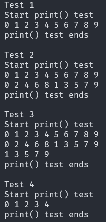

# Module - print()

## 1. Objectives definition. <!--Define the objective-->
### 1.1  Problem Analysis
The system must print the data entered by the user before and after it is sorted by the sorting system.

**Note** Each output line prints up to 10 values.
The last line may contain fewer values depending on the total number of elements.

**Example**
~~~
0 1 2 3 4 5 6 7 8 9
1 2 3 4 5 6 7 8 9 0
2 3 4 5
~~~
**What kind of data?**
`Integers`

**What kind of data structure?**
`Array`

**Does this module alter inputs value?**
No: it only print them.

**Does this module return any value?**
No: it does not return any value; it only prints data to the console

### 1.2 Requirements
The module must print all provided values without modifying them.
- An integer array with valid input
- The number of elements in the array

### 1.3 Purpose
This module is a subsystem that allows the `Sorting integer system` to print data to the user. It acts as a console interface module

### 1.4 Scope
**The module will:**
- Print a list of integer values from the array up to the specified number of elements.

### 1.5 Overall Analysis
In the Sorting integer system, the `print()` module is a subsystem whose sole purpose is to print data to the user via the console

## 2. Design the module
### 2.1 System Independence
This module is **dependent**, as it operates as a subsystem of the sorting system.
It does not perform sorting itself; instead, it provides output of sorted values to the user

**IPO chart - print()**

| Input                  | Process                                      | Output  |
|------------------------|----------------------------------------------|---------|
| List of integer values | Print each value, up to 10 elements per line | Console |
| Number of elements     |                                              |         |

### 2.2 Interaction with other modules
The module acts as an interface between the user and the sorting subsystem.
It allows the system  to print data before and after the data is processed
1. The `main()` evaluates if there is data to print:
   1. After user provided data with `getarray()`
   2. After `sort()` sorted those values
 
### 2.3 Dependencies
This module depends on:
- Standard Output (console output)
- The caller's memory buffer (the integer array provided as a parameter)
It does not allocate memory on its own and does not dependend on external storage of files

**Hierarchy chart**
~~~
                -----------
                | main()  |
                -----------
                    |
                    +
--------------  -----------     ----------
| getarray() |  | print() |     | sort() |
--------------  -----------     ----------
~~~

### 2.4 Overall design
The `print()` module is a subsystem of the overall `Sort system`
Its unique rol is:
- Print data to the user

### Write the code
~~~c
#include <stdio.h>
void print(const int array[], int limit)
{
    int index;

    for(index = 0; index < limit; index++){
        printf("%d ", array[index]);
        if(index % 10 == 9)
            putchar('\n');
    }
    if(index % 10 != 0)
        putchar('\n');
}
~~~

## 4. Test the module
### 4.1 Test plan
**Objective:**
Verify that the module prints each value correctly based on the number of elements provided as a parameter.

**What will be tested:**
1. All provided elements are printed
2. Exactly 10 elements are printed per line
3. If the last line contains fewer than 10 elements, a newline is printed

**Acceptance Criteria:**
- The module prints all values corretly and clearly to the user

### 4.2 Test procedure
#### Test Case 1 - 10 Elements
**Input:** `0 1 2 3 4 5 6 7 8 9`

**Step:**
1. Run the `test_print()` function
2. Pass an integer array with 10 elements
3. Capture the output displayed on the console

**Expected result:**
~~~
Start print() tests
0 1 2 3 4 5 6 7 8 9
print() tests end
~~~

#### Test Case 2 - 20 Elements
**Input:** `0 1 2 3 4 5 6 7 8 9 0 2 4 6 8 1 3 5 7 9`

**Step:**
1. Run the `test_print()` function
2. Pass an integer with 20 elements
3. Capture the output displayed on the console

**Expected result:**
~~~
Start print() tests
0 1 2 3 4 5 6 7 8 9
0 2 4 6 8 1 3 5 7 9
print() tests end
~~~

#### Test Case 3 - 25 Elements
**Input:** `0 1 2 3 4 5 6 7 8 9 0 2 4 6 8 1 3 5 7 9 1 3 5 7 9`

**Step:**
1. Run the `test_print()` function
2. Pass an integer with 25 elements
3. Capture the output displayed on the console

**Expected result:**
~~~
Start print() tests
0 1 2 3 4 5 6 7 8 9
0 2 4 6 8 1 3 5 7 9
1 3 5 7 9
print() tests end
~~~

#### Test Case 4 - 5 Elements
**Input:** `0 1 2 3 4 5 6 7 8 9 0 2 4 6 8 1 3 5 7 9`

**Step:**
1. Run the `test_print()` function
2. Pass an integer with 5 elements
3. Capture the output displayed on the console

**Expected result:**
~~~
Start print() tests
0 1 2 3 4 
print() tests end
~~~

### 4.3 Test result
The `print()` function was tested against four predefined test cases covering partial, full, and minimal output scenarios.
In all cases, the actual output matched the expected results, confirming correct handling of the limit parameter.

## 5. Maintenace
**Does this module have any limitation?**
Yes. It currently only prints integer values.

### 5.1 Current limitations
- Only prints integer value.
- Uses the `%d` format specifier

### 5.2 Recomendations for  futures improvements
- Replace the `%d` specifier with `%f` to support decimal numbers.

### 5.3 Notes
- Any change to the output format requires updating the test plan and all related test cases.